# Assignment EE4115

## Contextualisation

Data collection and management constitute a significant portion of the time and effort required to successfully carry out a deep learning project. This is especially true for physics-related applications, where collecting experimental data can be challenging. Most of the time, the acquisition is unlabeled, which further complicates its use for supervised learning. To address this issue, one approach is to rely on simulations. Simulated data offers the advantage of a controlled environment where labels are readily available. However, simulating complex physical processes, such as those involving interactions between millions of particles and many parameters, can be computationally expensive. To overcome these limitations, we can turn to synthetic data generation using neural networks. Such approach allows to generate new data for a fraction of the computation time, but the counterpart is that the diversity will be limited to what is present in the training dataset. In this project, we propose using CycleGAN to transform low-cost synthetic data into real-world-like data. Specifically, we aim to generate realistic cloud images from synthetic ones. In practical research scenarios, conditional models are often employed to control specific parameters of the generated data. However, for the purpose of this assignment, we will focus on a simplified case without conditioning to illustrate the core idea.

## Objectives

This project gives you a great autonomy. While it is not intended to be overly difficult, it does require some creativity to conducted effectively. If you have attended the practical works, the second part of the project will be straightforward. You must imperatively follow the structure of the functions provided, as deviations will cause the automatic tests to fail. You are permitted to use tools like ChatGPT or similar to assist in understanding or writing code. It is a normal procedure for developpers, but please remember that the generated code must be quality checked. Keep in mind that such tools may not always produce code that aligns perfectly with the project requirements, which could result in failing the automated testing. CTRL+SHIFT+F and type NotImplementedError to see all the functions that you have to implement.

## Deliverables

* You must push your code on GitHub.
* Push on your repo both the *train_opt.txt* and the *log_loss.txt* files that have been generated during the training step.
* Push also the four .pth files that correspond to the final trained model.
* Finally, push the mask that you have used to create the synthetic dataset.

## Installation

This project requires Conda for installation. If Conda is not already installed on your system, please refer to the installation guide I previously shared. Once you have cloned the repository to your local machine, you can install the project by following these steps:

```console
$ cd NUS_Deep_Learning_Assignment
$ conda env create -f environment.yml
$ conda activate cloud
$ pip install -e .
```

After installing the project and completing the necessary code implementation, you can use or test it either through a Jupyter Notebook or by running the specific commands (entry points) specified in the setup python file:

```console
$ web_scrapping REQUIRED_PARAMETERS
$ generate_real_clouds_dataset REQUIRED_PARAMETERS
$ generate_synthetic_clouds_dataset REQUIRED_PARAMETERS
$ dataset_formatting REQUIRED_PARAMETERS
```

The required parameters are specified in each python file in the build_argparser function.

## TODOs

### Real cloud image dataset creation

The [Singapore weather website](https://www.nea.gov.sg/corporate-functions/weather/satellite-images) offers satellite images of the South-East Asia region, with a new image captured every 20 minutes. By inspecting the URL of an image opened in a new tab, you will notice that only the date and time components change between successive images, making the data particularly straightforward to web scrape.

1. Write a web-scraping algorithm to download at least 2500 images. The corresponding python file can be found [here](https://github.com/mdellaiera/NUS_Deep_Learning_Assignment/blob/main/cloud/scripts/web_scrapping.py).

2. The size of the downloaded images is 1066x800, and they contain some information colored in yellow at the top left and bottom center. After loading them, crop the images to remove the tags so that their shape becomes 1024x512. Decompose them into 8 non-overlapping patches of size 256x256. The corresponding python file can be found [here](https://github.com/mdellaiera/NUS_Deep_Learning_Assignment/blob/main/cloud/scripts/generate_real_clouds_dataset.py). You will need to implement the functions in the utils file [here](https://github.com/mdellaiera/NUS_Deep_Learning_Assignment/blob/main/cloud/scripts/web_scrapping.py).

The following images illustrate some expected patches.

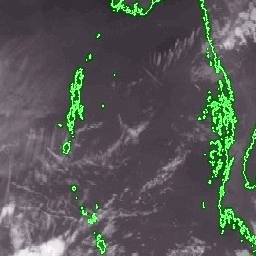
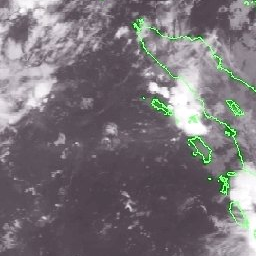
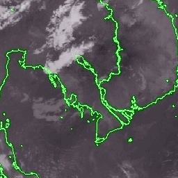
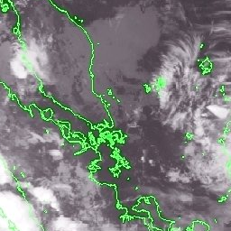


### Fake cloud image dataset creation

Artificial clouds can be generated using Perlin noise. Perlin noise are used to create smooth, structured textures that resemble the randomness found in nature, making it ideal for synthesizing cloud-like patterns. There are numerous implementations of Perlin noise available online using Python. These resources can be freely downloaded and tailored to fit the specific requirements of our application.

3. Since the real images display country borders in green, we also need to generate borders in our fake images in the form of binary masks. These masks can be created using any image processing software (such as GIMP) or programmatically using Python. It's not necessary for the borders in the fake images to be green initially, as the translation neural network can be trained to convert them into the appropriate green color during the image-to-image translation process. Generate such a mask. To do so, simply select one of your web scrapped image, open it in a image editing software, and isolate the green borders. The output can for example correspond to a single binary image (0 or 255) of size 1024x512.

4. Implement a Perlin noise generator using an existing online project. The corresponding python file can be found [here](https://github.com/mdellaiera/NUS_Deep_Learning_Assignment/blob/main/cloud/scripts/generate_synthetic_clouds_dataset.py).

The following images illustrate some expected patches. You can see the borders or the mask as white lines.


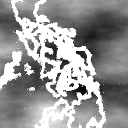

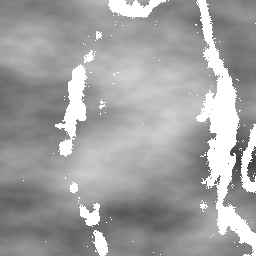
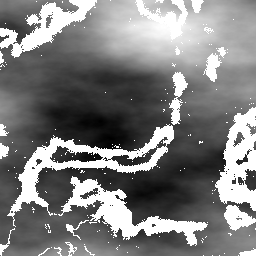

### Dataset formatting

We aim to exploit the datasets provided by the CycleGAN project. Similarly to what has been done during the practical work, we will decompose the datasets into four subsets.

5. Create the functions to divide both datasets into the expected subsets. The corresponding python file can be found [here](https://github.com/mdellaiera/NUS_Deep_Learning_Assignment/blob/main/cloud/scripts/dataset_formatting.py).

### CycleGAN training

The training must be conducted on the NUS HPC cluster (vanda). You can ask up to two GPUs for a single training.

6. Upload your dataset on the NUS HPC cluster and train the CycleGAN model. The hyperparametrization is left to you but must be justified.

The following images illustrate the results of the translation at different epochs (left to right corresponding to epoch 1, 5, 10, 15 and 20).

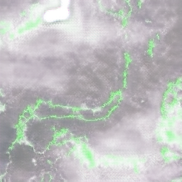
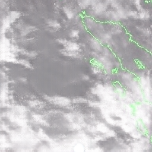
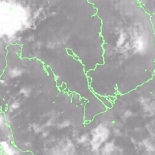
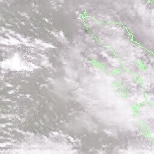
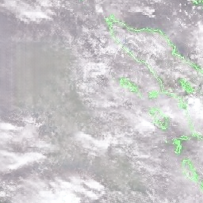